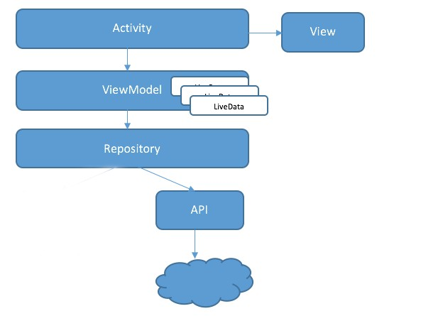
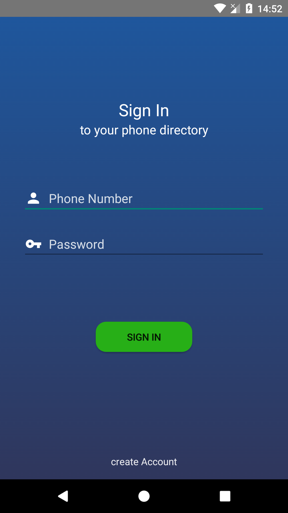
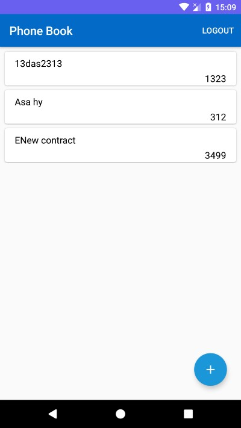
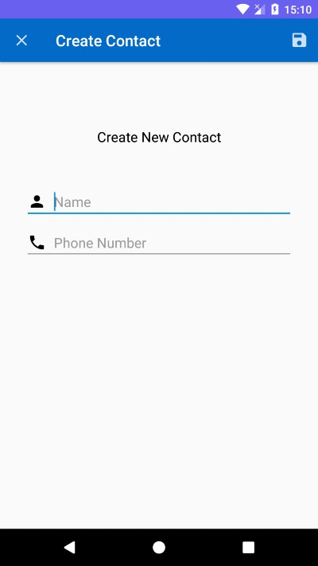
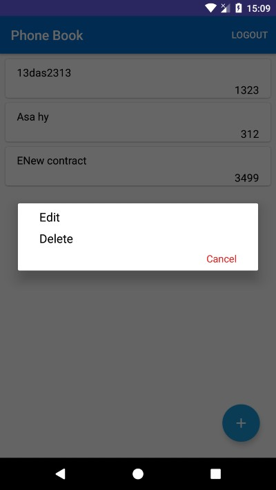
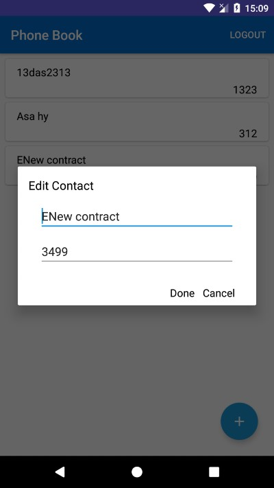

# Phonebook
The personalize phone directory to help person maintain contacts info.
The contacts are arranged in ALPHABETIC order

<h3>Highlights</h3>

  Application developed with Kotlin. 
  The application has been built to demonstrate implementation of MVVM architecture with web services using Retrofit.  
  It has been designed using Android Architecture components. 
  The application is built in such a way that whenever there is a remote service call, the result will be observed.

<h3>Architecture</h3>

The whole application is built based on the MVVM architectural pattern. 
The main advantage of using MVVM, there is no two way dependency between ViewModel and Model unlike MVP. Here the view can observe the data changes in the viewmodel as we are using <b>LiveData</b> which is lifecycle aware. The viewmodel to view communication is achieved through <b>Observer Pattern</b> (basically observing the state changes of the data in the viewmodel).

<h3>App Review</h3>
<ul>
<li>user can login in into his account</li>
<li>User will stay login until user logout from account himself</li>
<li>Application will keep checking for internet connection to avoid any crash during operations</li>
<li>user can view all the contacts</li>
<li>User can create new contact</li>
<li>User can delete existing account</li>
<li>User can perform these operations by swapping item to the left side</li>
<li>User can edit contact information</li>
</ul>

<h3>Images</h3>
 
 

